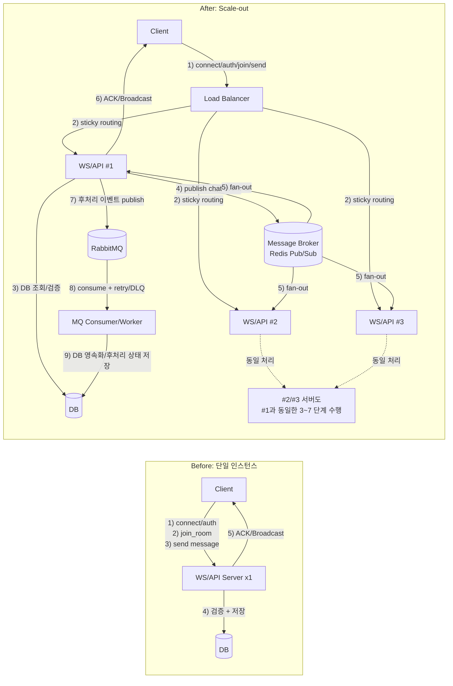

# WebSocket 채팅 부하 테스트 리포트

## 목차

- 핵심 결과
- 1. 문제 정의
- 2. 내가 맡은 역할
- 3. Scale-out 아키텍처와 설계 의도
  - 3.1 Before/After 아키텍처 비교
  - 3.2 설계 설명
- 4. 테스트 설계
- 5. 왜 `sla8`와 `diag15`를 함께 썼는가
- 6. 정량 비교 (핵심 구간)
  - 6.1 `sla8` 비교
  - 6.2 `diag15` 비교
- 7. 내가 내린 의사결정 포인트
- 8. 시스템 한계와 리스크
- 9. 실험 신뢰도와 한계
- 10. 다음 액션
- 11. 최종 결론

## 핵심 결과

1. 단일 인스턴스에서 `20 iters/s` 부근부터 시작되던 붕괴 구간을, Scale-out 후 `25~30 iters/s` 구간으로 지연시켰다.
2. `sla8@30`에서 `max_active_vus`는 `287 -> 101`로 감소했고, 실패형 붕괴가 지연형 포화로 완화됐다.
3. `diag15@30` p95는 `3803ms -> 1804ms`로 개선됐지만, 성공률 100%만으로는 UX 품질을 보장할 수 없음을 확인했다.

자세한 상황별 실험결과는 아래 두 링크에서 확인 가능합니다.

- [단일 인스턴스 부하 테스트 리포트](test-result.md)
- [scale-out 이후 부하 테스트 리포트](test-result-scaleout.md)

## 1. 문제 정의

실시간 WebSocket 채팅에서 "scale-out 하면 빨라진다" 수준이 아니라,

- capacity line(붕괴 시작선)이 어디서 시작되는지,
- scale-out 이후 붕괴 형태가 어떻게 바뀌는지,
- 성공률 지표만으로 놓치는 tail latency 리스크가 무엇인지
  를 정량적으로 검증하는 것이 목표였다.

## 2. 내가 맡은 역할

- 부하 테스트 시나리오와 측정 지표 설계
- 단일 인스턴스 baseline 및 scale-out 결과 매트릭스 비교 분석
- `sla8`(SLA 관점) / `diag15`(원인 분석 관점) 이중 프로파일 설계 및 해석
- 결과를 운영 의사결정 가능한 기준(capacity line, 위험 구간)으로 문서화

## 3. Scale-out 아키텍처와 설계 의도

### 3.1 Before/After 아키텍처 비교

### 3.2 설계 설명

- 실시간 전달 경로와 후처리 경로를 분리했다.
- 실시간 채팅 fan-out은 `Redis Pub/Sub` 백플레인으로 서버 간 전달을 담당한다.
- `RabbitMQ`는 실시간 ACK 경로가 아니라 비동기 후처리 이벤트 파이프라인으로 사용한다.
- MQ 소비자는 retry/DLQ를 포함해 실패를 흡수하고, 최종 영속화는 DB에 반영한다.
- LB sticky를 사용해 소켓 연결 소유 서버를 고정하고, scale-out 시 세션 혼선을 줄였다.

## 4. 테스트 설계

- 시나리오: `connect/authenticated -> join_room -> message -> disconnect`
- 도구: `k6` (`ramping-arrival-rate`), `Prometheus + Grafana`
- 부하 단계: `10 / 15 / 20 / 25 / 30 iters/s`
- 비교 문서:
  - 단일 baseline: `loadtest/k6/test-result.md`
  - scale-out: `loadtest/k6/test-result-scaleout.md`

## 5. 왜 `sla8`와 `diag15`를 함께 썼는가

- `sla8 (AUTH_TIMEOUT_MS=8000)`:
  - 실제 서비스 SLA 관점에서 "사용자가 체감하는 실패"를 보기 위한 기준
- `diag15 (AUTH_TIMEOUT_MS=15000)`:
  - timeout 창을 넓혀 실패를 지연으로 전환시켜, 원인 분석 관찰 창을 확보하기 위한 기준

핵심 해석은 다음이다.

- timeout을 늘리면 성공률이 높아 보일 수 있다.
- 하지만 p95/p99가 높으면 사용자 경험은 이미 나쁘다.
- 따라서 "성공률"과 "tail latency"를 분리해서 봐야 한다.

## 6. 정량 비교 (핵심 구간)

### 6.1 `sla8` 비교

| rate       | 단일 인스턴스                                               | Scale-out                                     | 해석                                |
| ---------- | ----------------------------------------------------------- | --------------------------------------------- | ----------------------------------- |
| 20 iters/s | join/msg 성공률 96.54%, p95 3452ms, dropped 51              | 성공률 100%, p95 15ms, dropped 0              | 붕괴 시작 구간이 안정 구간으로 전환 |
| 25 iters/s | join/msg 성공률 85.25%, p95 3458ms, dropped 118             | 성공률 100%, p95 42ms, dropped 0              | 실패율 방어 + 지연 개선             |
| 30 iters/s | join/msg 성공률 58.81%, p95 3517ms, dropped 168, max VU 287 | 성공률 100%, p95 360ms, dropped 7, max VU 101 | 실패형 붕괴 -> 지연형 포화          |

### 6.2 `diag15` 비교

| rate       | 단일 인스턴스                                      | Scale-out                                       | 해석                               |
| ---------- | -------------------------------------------------- | ----------------------------------------------- | ---------------------------------- |
| 20 iters/s | 성공률 100%, p95 2177ms, dropped 44                | 성공률 100%, p95 21ms, dropped 0                | 동시성 여유 증가                   |
| 25 iters/s | 성공률 98.41%, p95 3588ms, dropped 100             | 성공률 100%, p95 1016ms, dropped 23             | 포화 진입이 늦춰졌지만 고지연 시작 |
| 30 iters/s | 성공률 54.76%, p95 3803ms, dropped 151, max VU 270 | 성공률 100%, p95 1804ms, dropped 43, max VU 140 | 실패는 완화됐지만 UX 리스크 잔존   |

## 7. 내가 내린 의사결정 포인트

1. 평균 응답이 아니라 **capacity line 이동량**을 개선의 1차 기준으로 삼았다.
2. 성공률 100%라도 p95/p99와 dropped_iterations가 악화되면 안정 구간으로 보지 않았다.
3. 결론적으로 scale-out은 "붕괴 제거"가 아니라 "붕괴 시점 지연"으로 정의하는 것이 정확하다고 판단했다.

## 8. 시스템 한계와 리스크

- `25~30 iters/s`는 성공률 방어가 가능해도 tail latency가 빠르게 증가하는 구간이다.
- `ws_auth_success_rate`가 전 구간 100%인 점을 보면, 1차 병목은 인증보다 `join/message` 이후 처리 경로일 가능성이 높다.
- 따라서 이 구간에서 서비스 품질 평가는 성공률이 아니라 p95/p99 중심이어야 한다.

## 9. 실험 신뢰도와 한계

이번 결과는 방향성 판단에 충분히 유의미하지만, 아래 한계가 있다.

1. 반복 실행 기반 통계(분산/최악값) 보강 필요

- 각 rate 1회 결과가 아니라 최소 3회 반복 후 median/worst/variance 비교가 필요하다.

2. 실험 조건 명시 강화 필요

- warm-up 통제 방식, 인프라 리소스 제한값(CPU/메모리), 인스턴스 수를 리포트 본문에 고정값으로 명시해야 한다.

3. scale-out 구조 세부 명시 필요

- 백플레인(예: Redis adapter) 사용 여부, broadcast 경로, 룸 분산 전략을 함께 기록해야 재현성이 높아진다.

4. 단계별 지연 분해 필요

- auth/join/message를 분리 계측해 어느 단계에서 tail latency가 커지는지 추가 검증이 필요하다.

## 10. 다음 액션

1. 동일 매트릭스를 1/2/3 인스턴스로 반복 실행해 scaling efficiency 정량화
2. 단계별 p95/p99와 `ws_failure_total{reason}`를 결합해 병목 원인 분리
3. 워크로드 패턴(1:1, 1:N, 동일 room 집중, 다수 room 분산)별 한계선 재측정

## 11. 최종 결론

단일 인스턴스에서 `20 iters/s` 부근부터 시작되던 붕괴 구간을 scale-out 후 `25~30 iters/s`까지 지연시켰다. 다만 성공률 100%만으로는 안정성을 판단할 수 없었고, 실제 서비스 품질 기준에서는 tail latency와 dropped_iterations를 함께 봐야 한다는 점을 확인했다.
